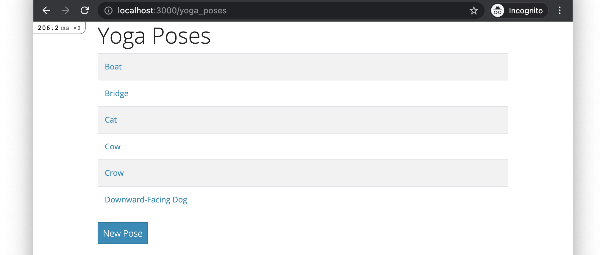
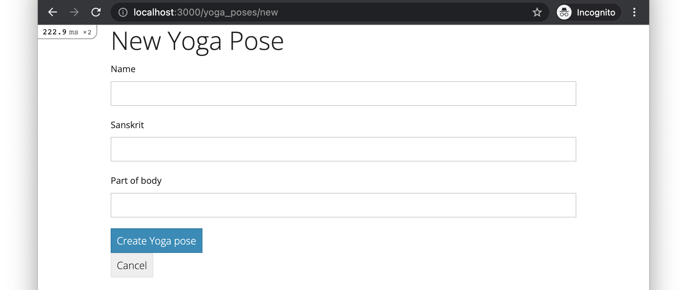
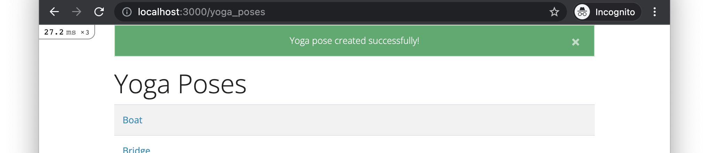
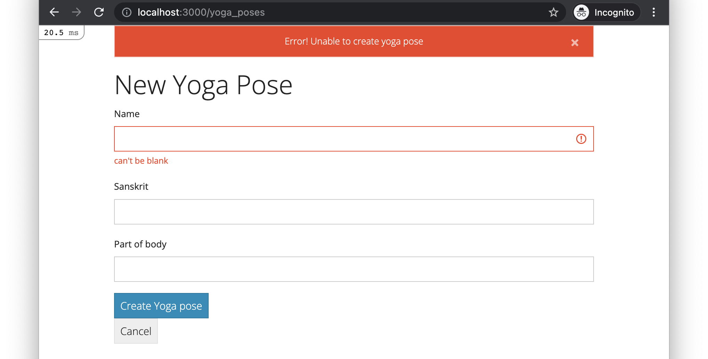

# Skills Test ST2

Time Limit: 30 minutes

## The Rules

- Closed neighbor.
- No texting/messaging/posting.
- Referring to the Demos-n-Deets and searching the web is OK.

## Starting the Test

1. `cd` into your workspace directory (this command may vary depending on how you named your directory):

    ```bash
    cd ~/workspace
    ```

2. Clone this repository into a working directory named `st2`:

    ```bash
    git clone PASTE_THE_REPO_URL_HERE ./st2
    ```

3. `cd` into the working directory:

    ```bash
    cd st2
    ```

4. Open the working directory in VS Code:

    ```bash
    code ./
    ```

5. Do the usual 2-step to initialize the project:

    ```bash
    bundle install
    rails db:migrate:reset db:seed
    ```

## About the Base App

Initially, the base app contains the following:

- A `YogaPose` model class with seeds script.
- A `YogaPosesController` controller class.
- The routes, controller actions, and view templates for index and show pages.
- A root route that redirects to the index page.
- The necessary infrastructure for displaying flash notifications.

If you run the base app and open <http://localhost:3000> in your browser, the following page should be displayed (note that the "New Pose" link is broken initially):



## Tasks to Perform

In completing all of the following tasks, build things in the ways described in the Demos-n-Deets and use all the standard naming conventions. As always, the CSS styling of things is a low priority, so don't get hung up on making yours match exactly.

1. **New/Create Form Page.** Create an new/create form page that looks like this (the "Cancel" link should link to the index page):

    

    If the form submission is successful, the app should be redirected to the index page and a flash success message should be displayed, like this:

    

    If the form submission fails, the app should re-render the form with error messages, like this:

    

    You can test the error messages by entering an invalid part_of_body value. See the model class for the details of the inclusion validation.

2. **Hyperlink.** Fix "New Pose" link on the index page so that it links to the new-form page.

## How to Submit

Once you've completed all of the above, submit your work by doing the following:

1. Commit all your changes to the local repo:

    ```bash
    git add -A
    git commit -m "Completed skills test"
    ```

2. Generate a ZIP archive of your project by running the following command:

    ```bash
    git archive -o ../st2-submission.zip --prefix=st2-submission/ HEAD
    ```

    This command should result in a file `st2-submission.zip` being created in your `workspace` folder.

3. Upload this ZIP file to the appropriate dropbox in Canvas.

    Hint: Windows users can run these commands to open a file explorer for their workspace folder:

    ```bash
    cd ..
    explorer.exe .
    ```
